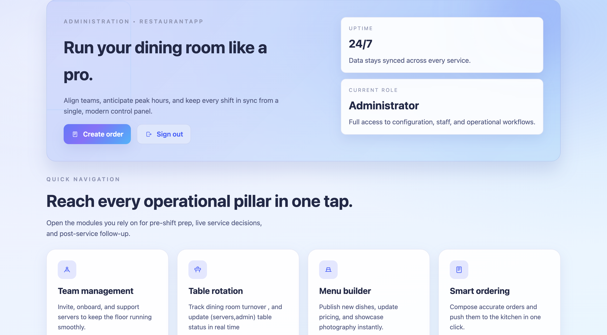

# 🍽️ RestaurantApp — 2025 Service Control Center

RestaurantApp is a full‑stack platform that gives administrators and floor staff everything they need to **run a modern dining room in real time**. From menu curation to order capture and table rotation, every workflow is streamlined in a polished, production-ready UI.

<p align="center">
  
</p>

---

## 🌟 Highlights

- 🔐 **Role-based authentication** with secure PHP sessions
- 🧾 **Smart ordering**: build carts, compute totals, and dispatch to the kitchen
- 📋 **Menu studio**: upload photos, set pricing, and publish instantly
- 🪑 **Table tracker**: flip availability, monitor capacity, and reduce wait time
- 👥 **Staff operations**: onboard servers and keep credentials in sync
- 🎨 **Next-gen UI**: bright glassmorphism theme, SVG icons, responsive layouts

---

## 🧱 Architecture Overview

| Layer      | Stack & Tools                                   | Responsibilities                                   |
|------------|--------------------------------------------------|----------------------------------------------------|
| Frontend   | React 19, React Router 7, Vite                  | Role-aware routing, pro dashboard UI, fetch APIs   |
| Styling    | Custom design system (`src/pro.css`)            | Glassmorphism theme, tokenized spacing & colors    |
| Backend    | PHP 8, MySQL                                    | Session auth, REST API for menu/orders/tables      |
| Deployment | Vite build artifacts + Apache/Nginx PHP hosting | Serve SPA assets, run backend APIs                 |

---

## 🚀 Quick Start

### 1. Clone the repository

```bash
git clone https://github.com/your-username/RestaurantApp.git
cd RestaurantApp
```

### 2. Frontend (Vite + React)

```bash
cd frontend
npm install
npm run dev      # launches http://localhost:5173 by default
```

### 3. Backend (PHP + MySQL)

1. Import the database schema into MySQL (see `backend/database.sql`).
2. Configure environment variables or `config.php` for DB credentials.
3. Run the PHP backend with Apache/Nginx or `php -S localhost:8000 -t backend`.

### 4. Environment variables

Create `frontend/.env` if needed:

```
VITE_API_BASE=http://localhost/RestaurantApp/backend/api
```

---

## 🧪 Scripts & Commands

| Command                | Description                                |
|------------------------|--------------------------------------------|
| `npm run dev`          | Start the Vite dev server                  |
| `npm run build`        | Produce optimized production assets        |
| `npm run preview`      | Preview the production bundle locally      |
| `npm run lint`         | Run ESLint (if configured)                 |

> ⚠️ *On macOS/Windows, you may need elevated permissions for Vite to create `.vite-temp` during the build. Run the command outside sandboxed environments if you see EPERM errors.*

---

## 📁 Project Structure

```
RestaurantApp/
├── backend/             # PHP REST API (auth, menu, orders, tables)
├── frontend/            # React application (Vite)
│   ├── src/
│   │   ├── assets/      # Branding & logo SVGs
│   │   ├── components/  # Reusable UI (TopBar, Icon, etc.)
│   │   ├── *.jsx        # Role-specific pages
│   │   └── pro.css      # Global design system
│   └── public/          # Static assets (favicon, index.html)
└── README.md
```

---

## 🗺️ Roadmap

- [ ] Integrate real-time order updates via WebSockets  
- [ ] Add unit & integration tests for critical workflows  
- [ ] Build analytics dashboards (sales, table turnover, staff KPIs)  
- [ ] Ship multi-language support (i18n) across UI and emails  

---

## 🤝 Contributing

Pull requests are welcome! Please:

1. Fork the project  
2. Create a feature branch (`git checkout -b feature/amazing`)  
3. Commit your changes (`git commit -m 'Add amazing feature'`)  
4. Push the branch (`git push origin feature/amazing`)  
5. Open a Pull Request  

---

## 📄 License

MIT License © 2025 [Zaka41a]

---

### 💬 Need help or want to collaborate?

Open an issue, reach out on [LinkedIn](https://www.linkedin.com/in/zakaria-sabiri-8a97b4364/), or follow the roadmap above. Let’s build a world-class dining room experience together!
